# 🚀 Hemanth Issai - Django Portfolio

A full-stack Django portfolio website with custom admin dashboard, authentication system, and interactive features.


## ✨ Features

### 🎨 **Public Portfolio**
- **Home Page** - Typing animation, cloud architecture visualizer, interactive terminal
- **About Section** - Bio, education, tech stack overview with progress bars
- **Projects Section** - Dynamic project cards with GitHub, Docker Hub, and live demo links
- **Certifications** - Display certifications with organization, dates, and verification links
- **Contact Form** - Working form with email integration and database storage
- **Code Snippets** - Docker, Git, CI/CD examples with one-click copy functionality

### 🎮 **Interactive Elements**
- **Voice Commands** - Control portfolio with voice ("dark mode", "show projects", "open terminal")
- **Terminal Game** - Interactive terminal with DevOps commands (try `help`, `whoami`, `projects`)
- **Cloud Architecture Visualizer** - Clickable microservices diagram showing real Docker Hub stats
- **Tech Stack Radar** - Interactive skill visualization with expert/proficient/familiar levels
- **Dark/Light Theme** - Toggle between themes with localStorage persistence

### 🔐 **Authentication & Dashboard**
- **User Authentication** - Complete signup/login/logout with validation
- **Role-Based Access** - Admin (`*****`) vs Viewer permissions
- **Custom Dashboard** - Beautiful dark-themed admin interface with stats cards
- **Project CRUD** - Add/Edit/Delete projects with beautiful forms (Admin only)
- **Certification CRUD** - Manage certifications with delete confirmation (Admin only)
- **Message Viewer** - View all contact form submissions in dashboard

### 🗄️ **Database & Backend**
- **PostgreSQL** - Production-ready database integration
- **Dynamic Content** - All projects/certifications pulled from database
- **Slug URLs** - Clean SEO-friendly URLs like `/projects/project-name/`
- **Email Integration** - Contact form with automated replies via Gmail SMTP
- **Admin Panel** - Customized Django admin with search, filters, and slug auto-generation

## 👥 **User Roles**

| Role | Username | Password | Permissions |
|------|----------|----------|-------------|
| **Admin** | `*****` | `****` | Full CRUD access (Add/Edit/Delete) |
| **Viewer** | Any signup | Any | View-only dashboard access |

## 🛠️ **Tech Stack**
Backend: Django 6.0, PostgreSQL, Python 3.12
Frontend: HTML5, CSS3, JavaScript, Font Awesome 6
Database: PostgreSQL with DBeaver
Email: SMTP with Gmail (python-decouple for secrets)
Other: Git, python-decouple, psycopg2-binary


## 📁 **Project Structure**
my-profile/
├── manage.py
├── requirements.txt
├── polls/ # Main application
│ ├── models.py # Database models
│ ├── views.py # All view logic
│ ├── admin.py # Admin panel customization
│ └── urls.py # App URLs
├── protfolio/ # Project configuration
│ └── settings.py # Django settings with env vars
├── templates/ # All HTML files
│ ├── certifications/ # Certificate pages
│ ├── dashboard/ # Admin dashboard (8 files)
│ ├── projects/ # Project detail pages
│ ├── registration/ # Login/Signup pages
│ └── portfolio.html # Main portfolio
└── static/ # Static assets
├── css/ # style.css
├── js/ # script.js with all interactions
└── documents/ # Resume PDF


## 🚀 **Installation Guide**

### **Prerequisites**
- Python 3.12+
- PostgreSQL
- Git
- Gmail account (for email)

### **Step 1: Clone the Repository**
```bash
git clone https://github.com/Hemanth870-tech/my-portfolio.git
cd django-portfolio

Step 2: Create Virtual Environment
# Windows
python -m venv venv
venv\Scripts\activate
# Mac/Linux
python3 -m venv venv
source venv/bin/activate

Step 3: Install Dependencies
pip install -r requirements.txt

Step 4: Create PostgreSQL Database
-- Open pgAdmin or psql and run:
CREATE DATABASE hemanth_portfolio_db;
CREATE USER hemanth_portfolio_user WITH PASSWORD 'your_password';
ALTER ROLE hemanth_portfolio_user SET client_encoding TO 'utf8';
ALTER ROLE hemanth_portfolio_user SET default_transaction_isolation TO 'read committed';
ALTER ROLE hemanth_portfolio_user SET timezone TO 'UTC';
GRANT ALL PRIVILEGES ON DATABASE hemanth_portfolio_db TO hemanth_portfolio_user;

Step 5: Create .env File
Create a .env file in the my-profile/ folder:
# Django Secret Key (generate one at https://djecrety.ir/)
SECRET_KEY=your-secret-key-here

# Database Configuration
DB_NAME=hemanth_portfolio_db
DB_USER=hemanth_portfolio_user
DB_PASSWORD=your_database_password
DB_HOST=localhost
DB_PORT=5432

# Email Configuration (Gmail with App Password)
EMAIL_HOST_USER=your-email@gmail.com
EMAIL_HOST_PASSWORD=your-gmail-app-password

Step 6: Run Migrations
cd my-profile
python manage.py makemigrations
python manage.py migrate

Step 7: Create Admin Users for accessing the django-admin-panel
python manage.py createsuperuser

Step 8: Run Server
python manage.py runserver

Step 9: Visit the Site
Portfolio: http://127.0.0.1:8000/
Dashboard: http://127.0.0.1:8000/dashboard/
Admin Panel: http://127.0.0.1:8000/admin/

🎯 Features Showcase
Voice Commands
Click the microphone icon and try saying:
"Switch to dark mode" / "light mode"
"Show my projects"
"Show certifications"
"Go to contact section"
"Start voice" / "stop voice"

Terminal Game
Click the terminal icon or press Ctrl+T and try:
$ help           - Show all commands
$ whoami         - About me
$ projects       - List all projects
$ skills         - Show tech skills
$ ls             - List directory
$ pwd            - Current path
$ date           - Show current date
$ theme          - Toggle dark/light mode
$ echo Hello     - Print message
$ clear          - Clear terminal

Cloud Visualizer
In the Cloud Architecture Visualizer:
Click on Docker - See real Docker Hub stats (97+ pulls)
Click on Database - Redis cache info
Click on API - Gateway details
Click on Monitoring - Prometheus/Grafana stack
Try Microservices/Monolithic toggle buttons

Tech Stack Radar
Click any icon (Docker, Git, Python, etc.) to see detailed info
Filter by level using Expert/Proficient/Familiar buttons
Hover for visual feedback

## SCREENSHOTS:
1. START:
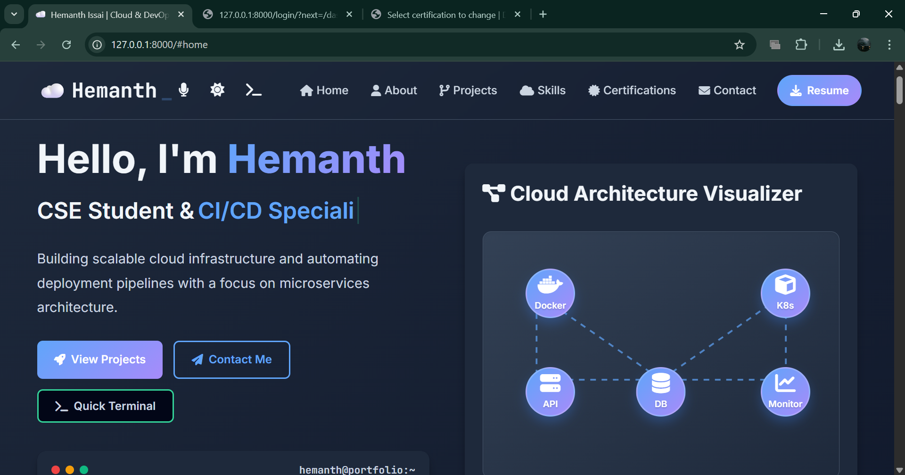
2. TERMINAL GAME:
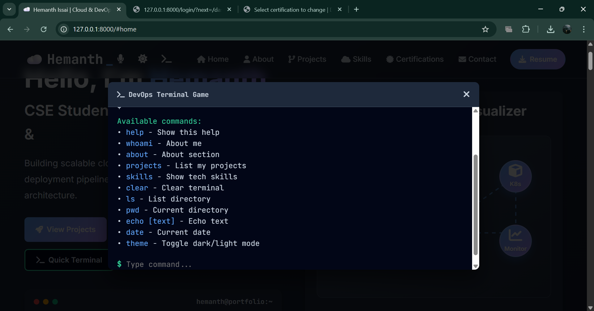
3. EACH PROJECT CONSIST OF ITS OWN CODE LINKS , LIVE LINKS , DOCKER LINKS AND EACH PROJECT CONSIST OF ITS OWN SLUG URL:
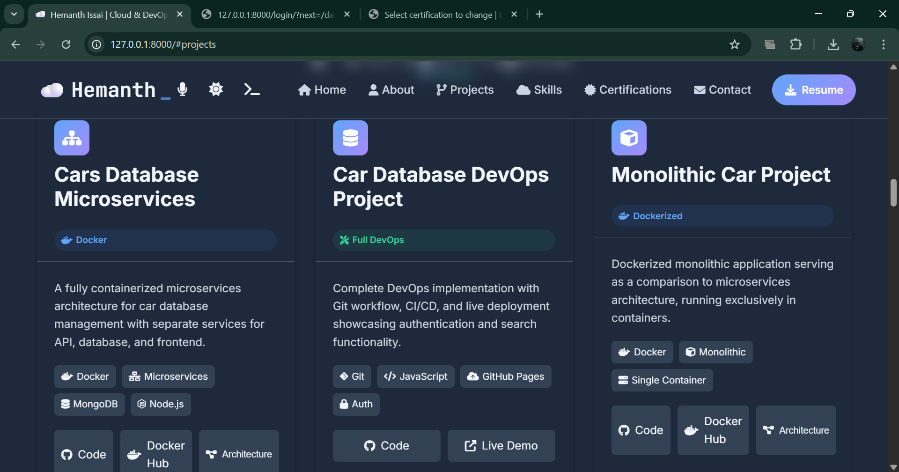
SLUG URL:
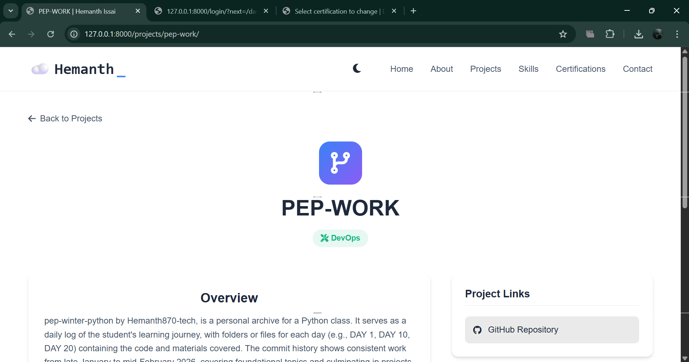
4. TECH STACK:
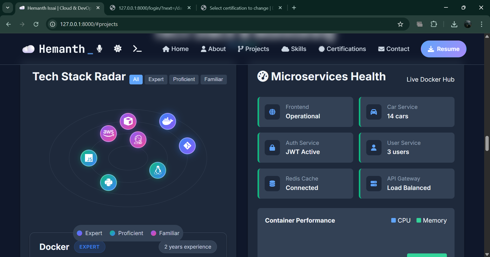
5. AS SAME AS PROJECTS, CERTIFICATES ALSO CONSIST OF SLUG:

6. DASHBOARD LOGIN , ( ADDING, EDITING,DELETING PROJECTS , CERTIFICATES ):
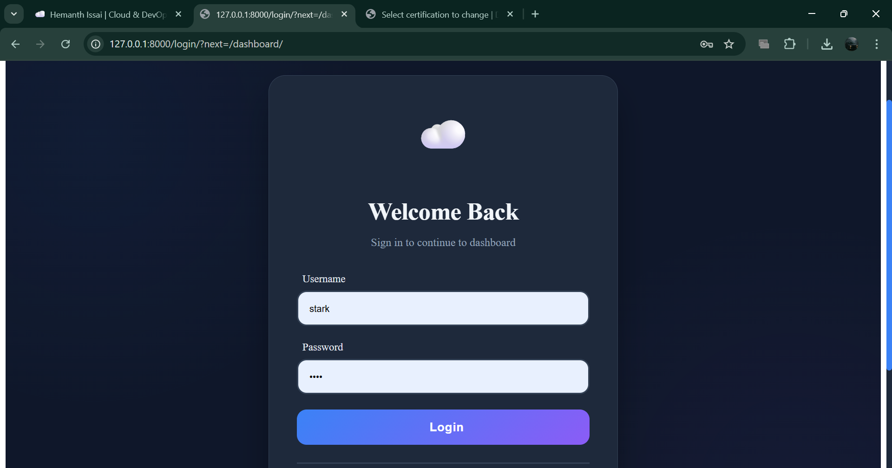
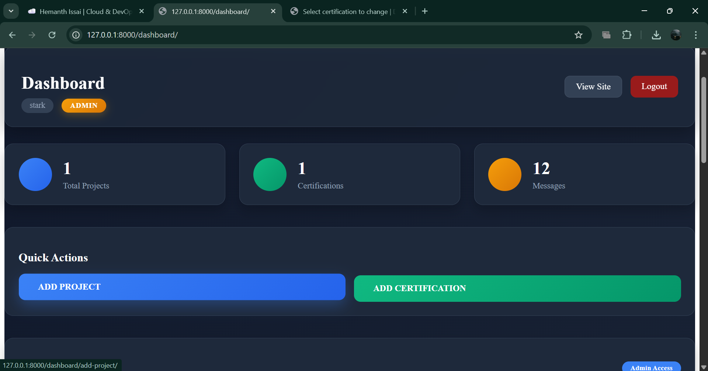
7. DJANGO-ADMIN-PANEL MODELS:
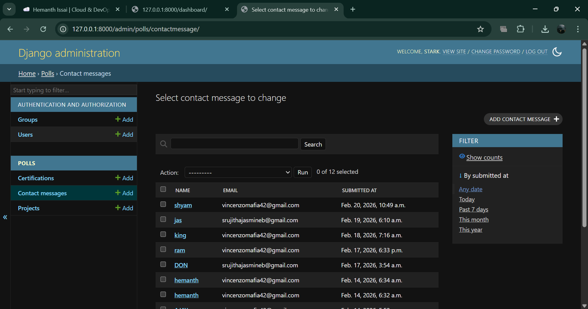
8. EMAIL SENDER:
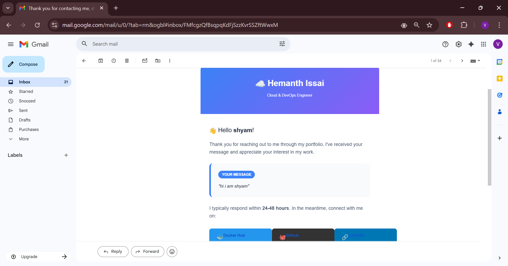
8. DATABSES IN DB_EAVER FOR PROJECTS,CONTACT MESSAGE, CERTIFICATES:
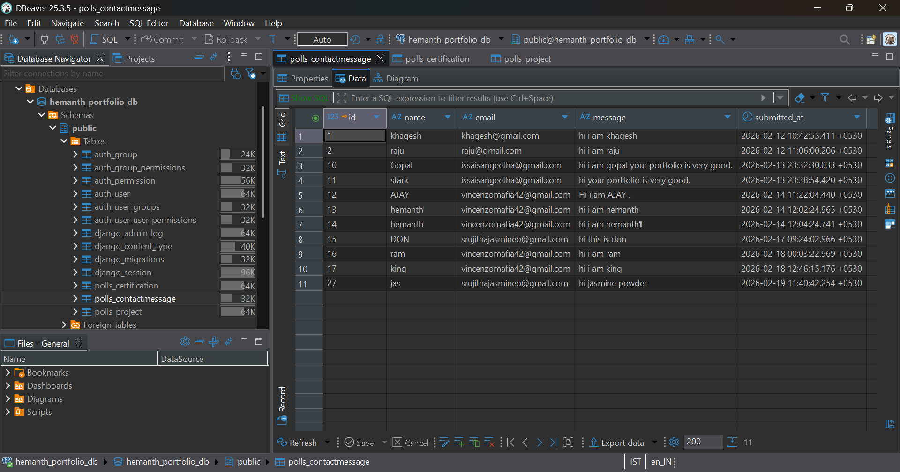 
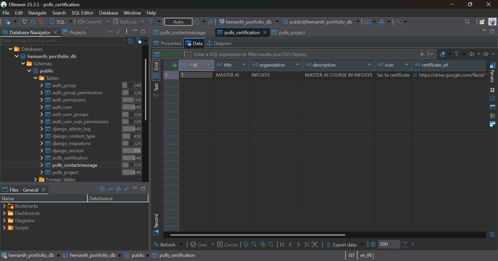
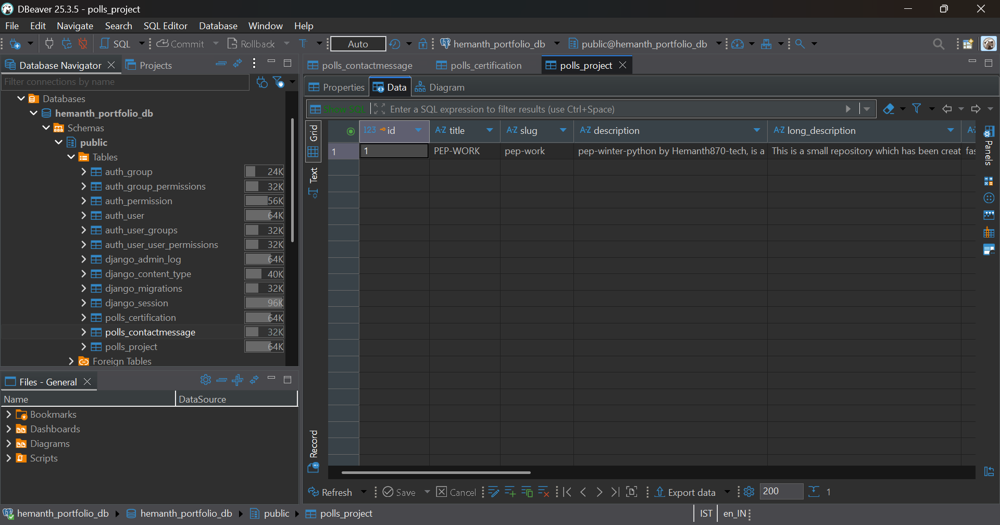
